# TdDx Store

A queue-driven dataset downloader for [ThetaData](https://thetadata.net).
Cross-platform desktop app + companion CLI, built on Tauri 2 + SvelteKit
over the [ThetaDataDx SDK](https://crates.io/crates/thetadatadx-rs).

Browse the dataset catalogue — stocks, options, indices and rates, across
trades, NBBO quotes, OHLC, EOD, greeks and open interest — queue
downloads, watch live progress, and write parquet / csv / json / jsonl.
The catalogue is the SDK's own endpoint registry, so it never advertises
a dataset the server does not serve. The app reads your subscription
tiers at connect time, greys out what your plan does not cover, links to
the upgrade page, and ships scheduling, coverage maps, parquet preview
and a health panel.

## A tour

Sign in with an API key from the account portal, or with the email and
password you use on thetadata.net. Either is stored in the OS keychain
via Stronghold; `THETADATA_API_KEY` signs you in without typing
anything.

<p align="center">
  
  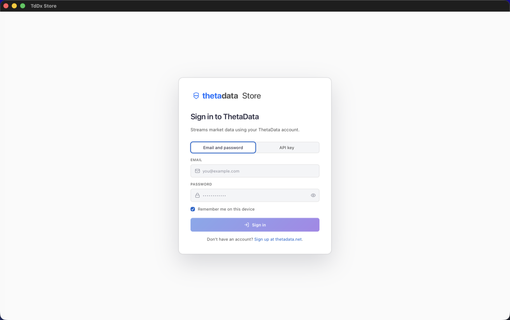
</p>

**Home** opens on what your plan covers, what is already on disk, and
what ran recently.

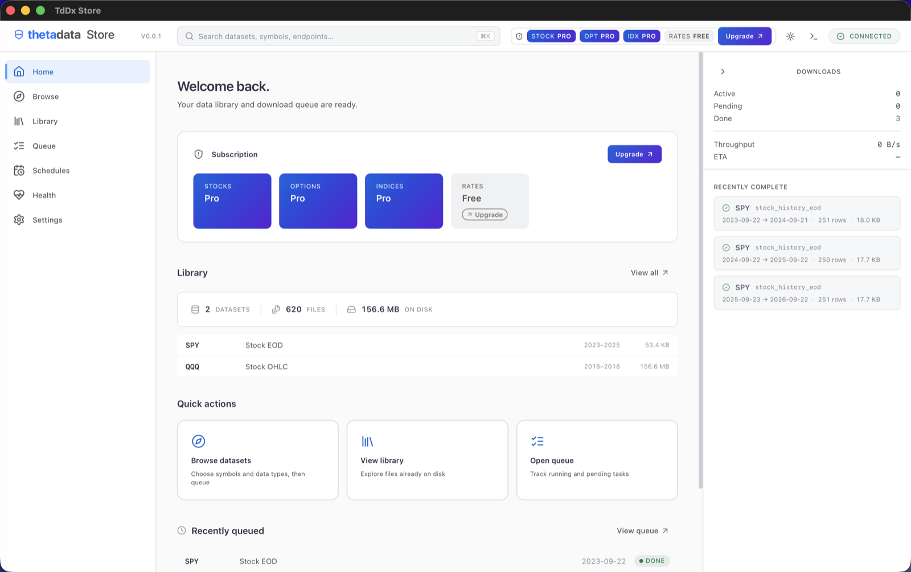

**Browse** is the whole catalogue, as six steps. Pick an asset class and
a symbol, and the dataset list shows every endpoint the SDK registry
serves for it, each with the tier it needs — greyed out when your plan
does not reach it, with the upgrade link where the button would be.

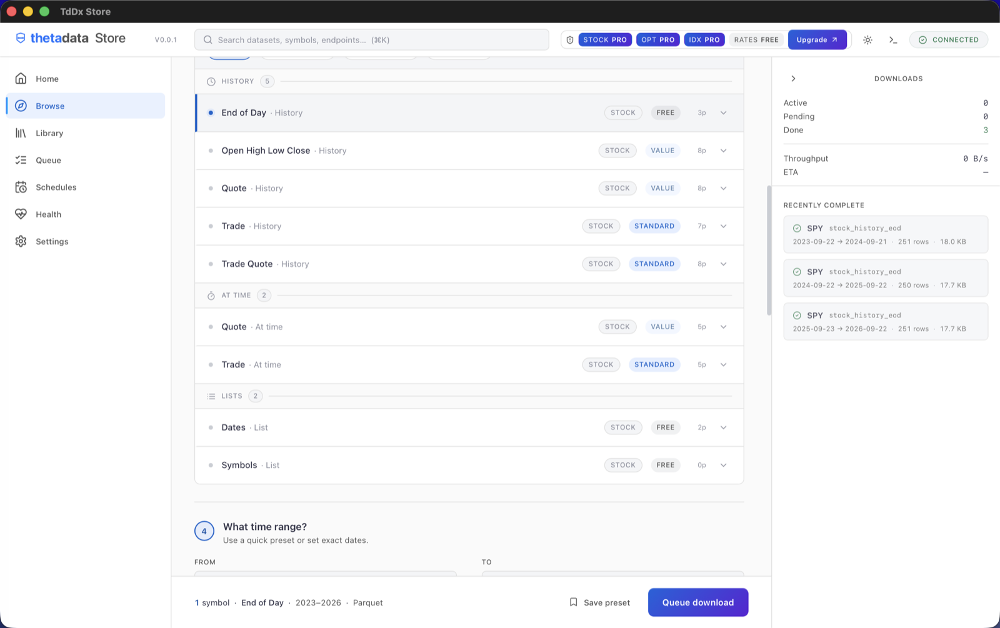

Then a window, a format, and whatever optional parameters that endpoint
declares. The row estimate is computed before you commit to anything:
three years of SPY End of Day is 14.8 KB, and three years of SPY quotes
is 11.8 GB. Better to learn that here than from a full disk.

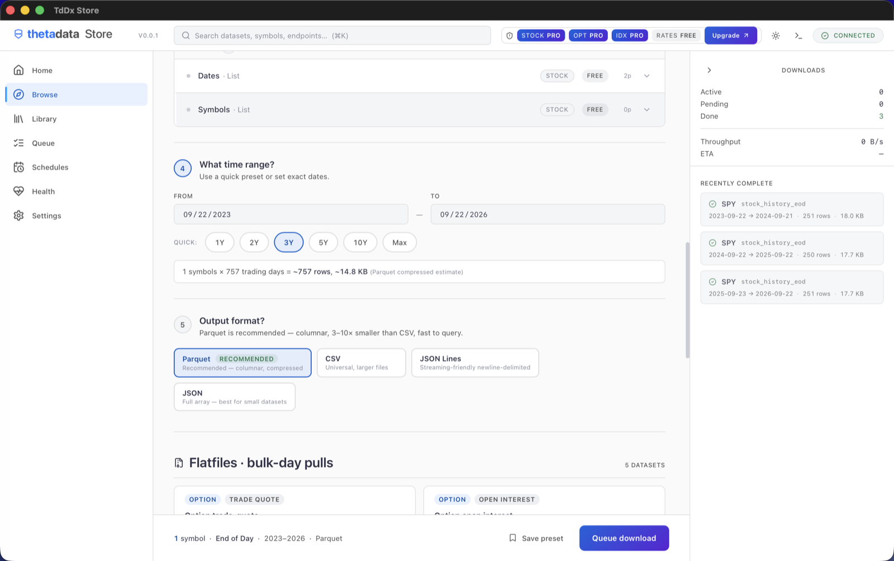

Below the per-symbol datasets sit the **flat files** — the daily bulk
archives, whole market in one file per trading day. The app offers the
five ThetaData actually serves, read from the SDK rather than a list
kept here that could drift.

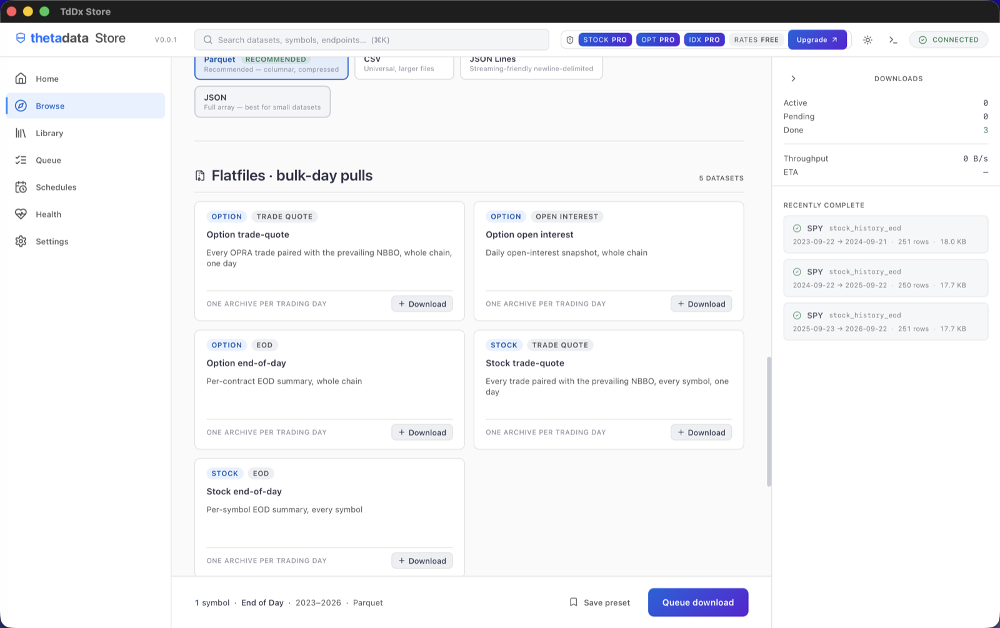

**Queue** is what happens after you press the button. Work is split into
tasks, run against an account-wide concurrency budget, and each row
carries its window, its row count and its size. Select with checkboxes
and shift-click, filter, cancel, retry, re-prioritise or clear —
everything acts on the whole queue, not the page you can see.

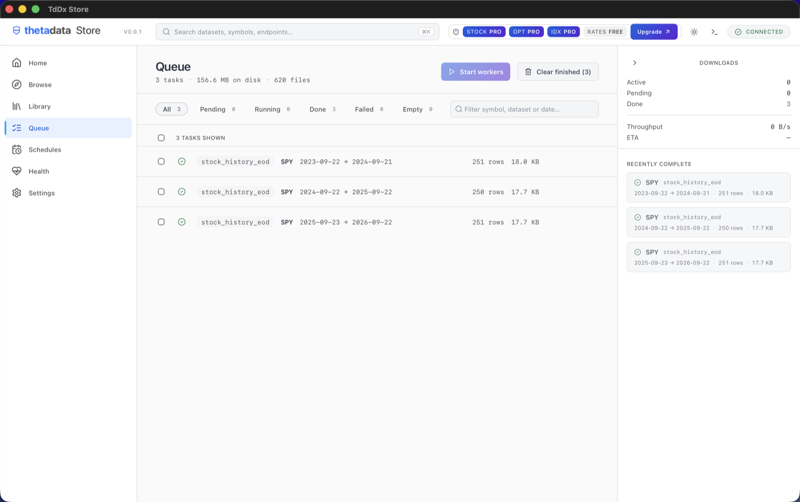

A three-year End of Day request is three tasks, not one. Those endpoints
reject a window wider than a year, so the app splits a longer one into
pieces the server accepts, balanced and contiguous, and shows the window
each task covers. The limit is a transport detail; you should not have
to know it exists.

**Library** is what you have. Datasets group by symbol with their span
and footprint, gaps can be checked and refilled per symbol, "Changes"
diffs against a saved snapshot, and **DuckDB** copies a script that
exposes everything on disk as queryable views — the shortest path from
downloaded to queried.

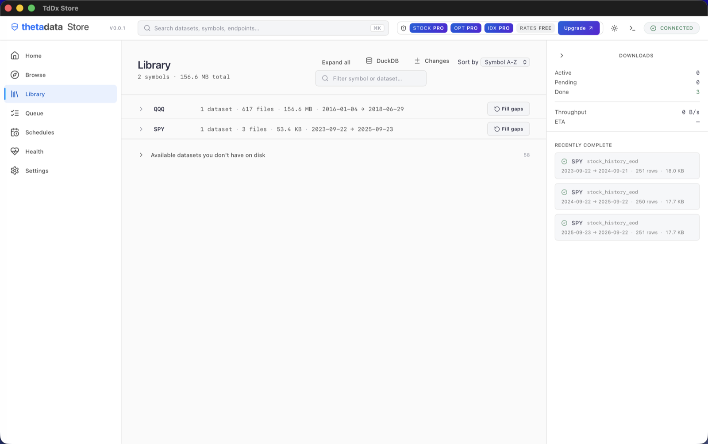

**Schedules** re-runs a dataset for a symbol on the days you choose. The
session it fetches is resolved in Eastern time, so an evening schedule
gets that day's close rather than yesterday's, and weekends roll back to
Friday.

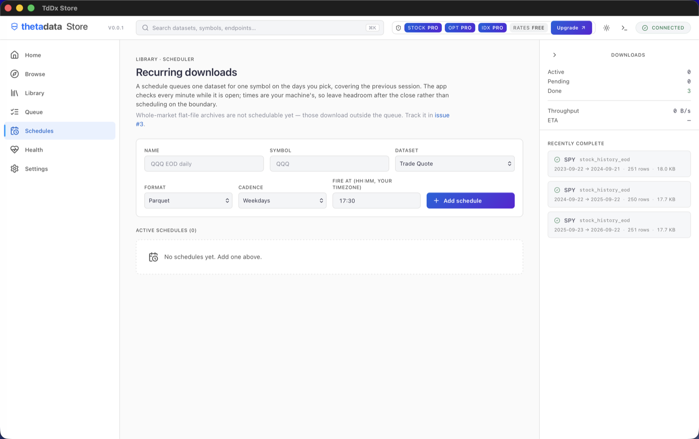

**Health** is the diagnostic panel: connection, pool occupancy against
the budget, queue counts, on-disk footprint, uptime, and the exact SDK
version the binary was built against.

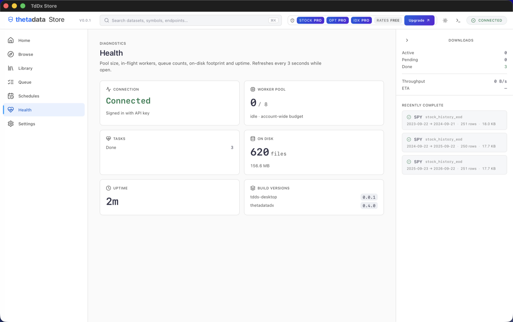

**Settings** holds the account and the two paths that matter — the queue
database and the output directory. Both persist, and moving the database
moves the live queue with it rather than quietly leaving it behind.

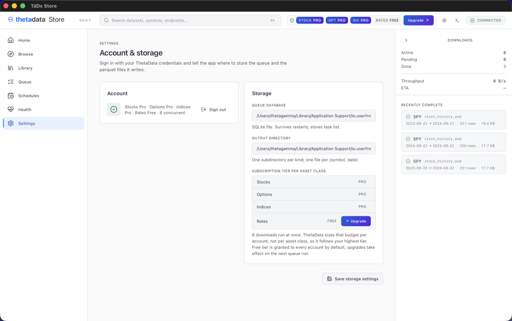

`⌘K` searches the catalogue, your symbol caches and your saved presets
at once. Every dataset is reachable by name, including the eight
different things called "Quote", which the endpoint beside each result
tells apart.

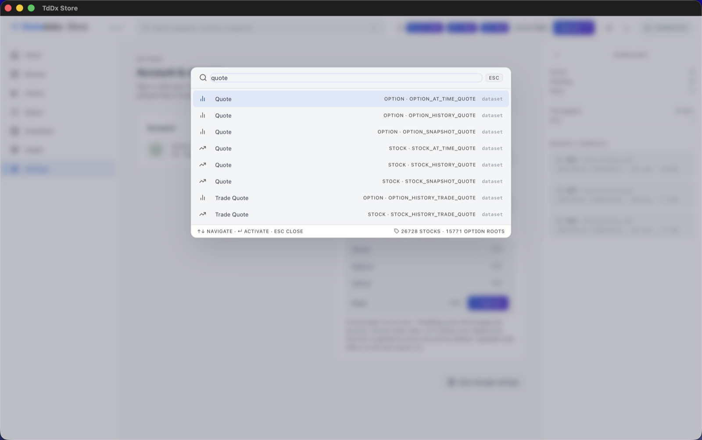

There is a dark theme. It is the same blue, differentiated by weight and
gradient rather than by a second hue — the reasoning, and the four
directions rejected on the way, are in [DESIGN.md](DESIGN.md).

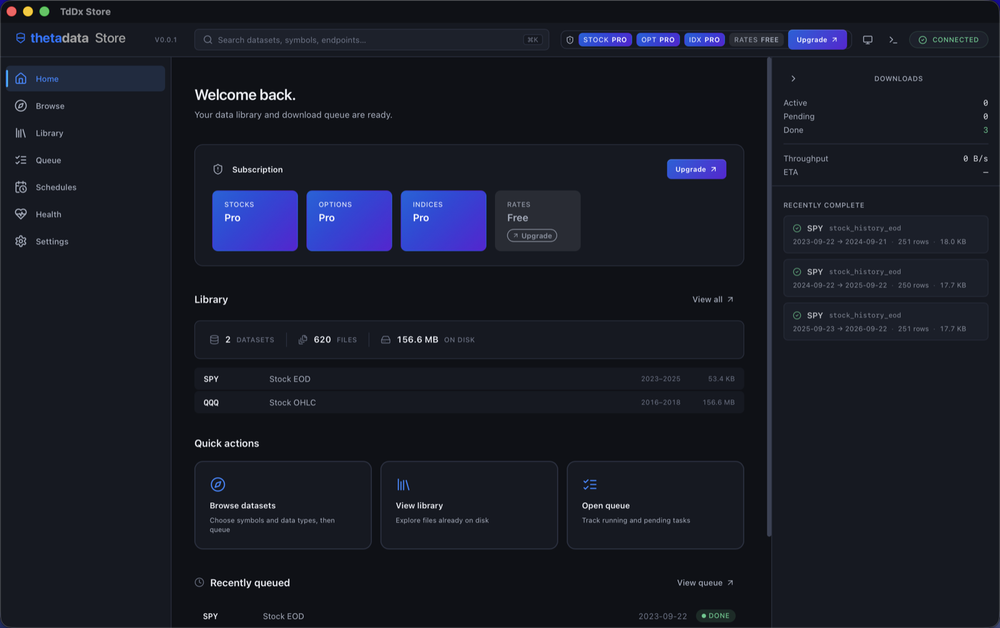

## Quick start

```bash
# Desktop app (dev)
cd apps/desktop
npm install
npm run tauri dev

# CLI
cargo run -p tdds-cli -- --help
```

The CLI binary is `tddx-store`.

## Workspace layout

```
.
├── apps/desktop/          # Tauri 2 + SvelteKit + Vite + TS
│   ├── src/               # Svelte UI (feature-grouped under src/lib/)
│   └── src-tauri/         # Rust backend (commands/ split by domain)
├── crates/
│   ├── tdds-core/         # Engine: queue, worker pool, registry, format,
│   │                      # coverage, schedule, tier-gating, …
│   └── tdds-cli/          # `tddx-store` CLI on top of tdds-core
├── .github/workflows/     # ci.yml (push/PR) + release.yml (tag-driven matrix)
└── DESIGN.md ROADMAP.md
```

## How it talks to ThetaData

One dependency: `thetadatadx-rs` from crates.io, with the `arrow`
feature. Its lib target is `thetadatadx`, which is the name every `use`
site spells.

- **Market data** goes through the SDK's endpoint registry. One
  dispatcher (`tdds_core::registry`) serves the queue, the endpoint
  runner, list queries and schedules, so argument validation and Arrow
  column projection happen in exactly one place.
- **Flat files** are the daily bulk archives. ThetaData serves five
  datasets and rejects everything else: option `trade_quote` /
  `open_interest` / `eod` and stock `trade_quote` / `eod`. The Browse
  shelf reads that list from the SDK rather than hard-coding it, and the
  download command re-checks before spending a round-trip.
- **Concurrency** is one account-wide budget of `2^tier` in-flight
  requests, taken from your highest per-class tier. It is not the sum of
  the per-class budgets: ThetaData's limiter is account-wide, and
  requests past the budget are queued and paced server-side rather than
  processed in parallel.

## Design

The palette, type scale, spacing, radii and action styling come from the
ThetaData UI foundations sheet, compressed to working density. Light is
the default theme; a dark variant ships for long sessions. Details and
the full token set are in [DESIGN.md](DESIGN.md).

## Releases

Tag a `v*.*.*` to fan out a multi-platform build via
`tauri-apps/tauri-action`:

```bash
git tag v0.0.1 -m "first release"
git push --tags
```

The release workflow produces a draft GitHub release with:
- macOS `.dmg` + `.app` (universal, Apple Silicon + Intel)
- Linux `.deb` + `.AppImage` + `.rpm`
- Windows `.msi` + `.exe` (NSIS)

Unsigned binaries trigger Gatekeeper / SmartScreen warnings on first
launch. Apple Developer ID + Authenticode signing wire in via
`tauri-action` secrets when available.

## Tauri plugins in use

`single-instance`, `window-state`, `store`, `clipboard-manager`, `os`,
`process`, `sql` (sqlite), `dialog`, `fs`, `opener`, `notification`,
`stronghold`, `updater`. All paths resolve via
`app.path().app_local_data_dir()` (XDG on Linux, Application Support on
macOS, LOCALAPPDATA on Windows).

## License

MIT. See [LICENSE](LICENSE).
